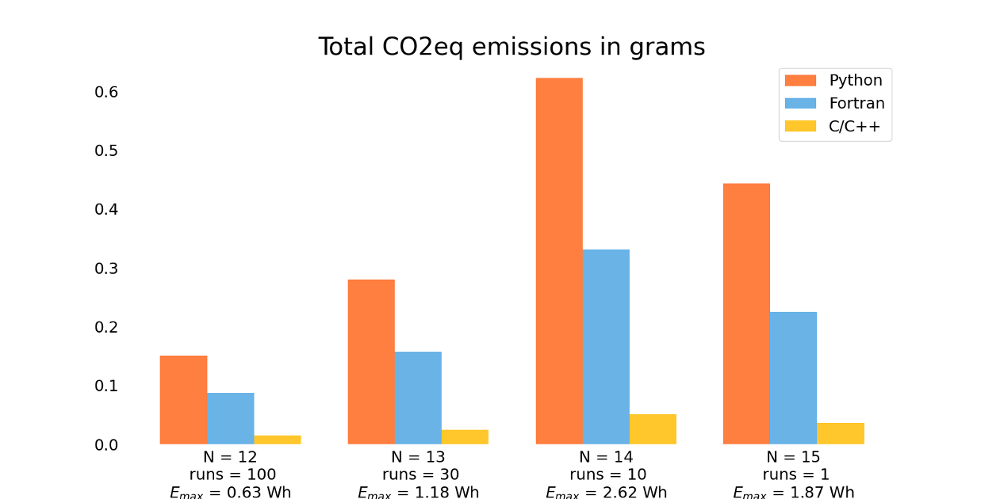
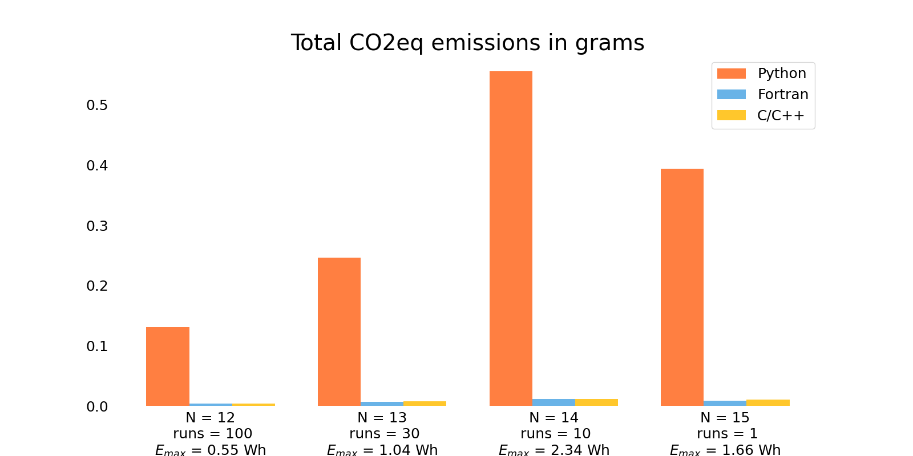

# Emission track demo
A sample of code to demo software carbon emission measurement.

## Create a virtual enviroment

You can create the development environment and use it by by running the following commands in the base directory of your cloned copy of the repo:

Create a virtual environment inside your working copy of the repo:
```
python -m venv .venv
```

Now activate this environment by running:
```
. .venv/bin/activate
```

Now install required packages:
```
pip install -r requirements.txt
```

To deactivate the environment just run:
```
deactivate
```

To re-activate the environment just run:
```
. .venv/bin/activate
```

See demo notebook `demo.ipynb` for running the example code with carbon emissions tracking.

Below are a couple of result plots. First for the demo code as is:



Second for the same demo code, but turning off output to stdout and compiling the C/C++ and Fortran code with compiler optimisation flags enabled. 


